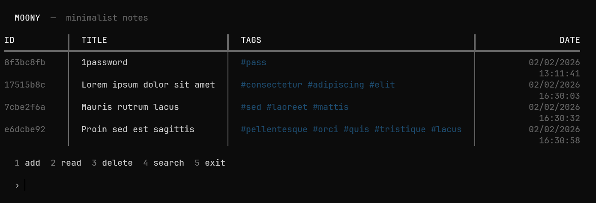
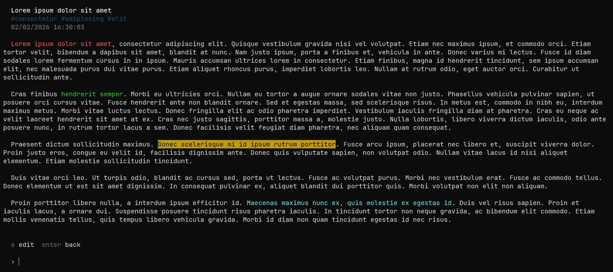
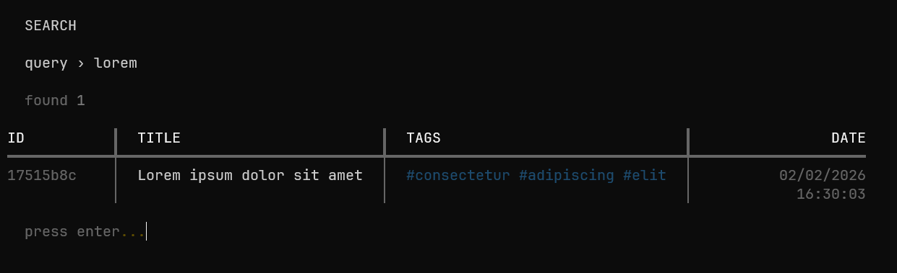

# MOONY


minimalist encrypted note-taking app

## features

- **encrypted storage** — notes secured with Fernet encryption
- **password protected** — SHA-256 hashed authentication
- **text formatting** — custom markup syntax
- **tagging system** — organize with tags
- **search** — find notes by title, content, or tags
- **inline editing** — edit notes directly

## preview

### note list


### reading


### search


## installation

1. clone the repository:

```bash
git clone https://github.com/doganibrahim/moony.git
cd moony
```

2. install dependencies:

```bash
pip install rich cryptography prompt_toolkit
```

3. run the app:

```bash
python main.py
```

## usage

```bash
python main.py
```

### first run

1. set password
2. login
3. start taking notes

### text formatting

use special syntax in your notes:

- `!w{text}` — warning (red)
- `!i{text}` — info (green)
- `!h{text}` — highlight (yellow background)
- `!n{text}` — note (cyan)

example:
```
!w{important:} this is urgent
!i{done} task completed
!h{remember} meeting at 3pm
!n{tip:} use tags for better organization
```

### keyboard shortcuts

**multiline editor:**
- `CTRL + S` — save
- `CTRL + C` — cancel
- `ENTER` — new line

**note view:**
- `e` — edit note
- `ENTER` — back to list

## file structure

```
moony/
├── main.py          # main application
├── auth.py          # authentication system
├── models.py        # note and notebook models
├── utils.py         # utilities and encryption
├── notes.bin        # encrypted notes (auto-generated)
├── secret.key       # encryption key (auto-generated)
└── user.lock        # password hash (auto-generated)
```

## security

- notes encrypted with Fernet (symmetric encryption)
- password hashed with SHA-256
- encryption key stored locally
- **note:** if you lose `secret.key`, your notes cannot be decrypted

## tips

- tags are comma-separated: `work, urgent, meeting`
- search is case-insensitive
- leave fields empty when editing to keep current values
- note IDs are shown in the main list

## license

MIT License - feel free to use and modify
